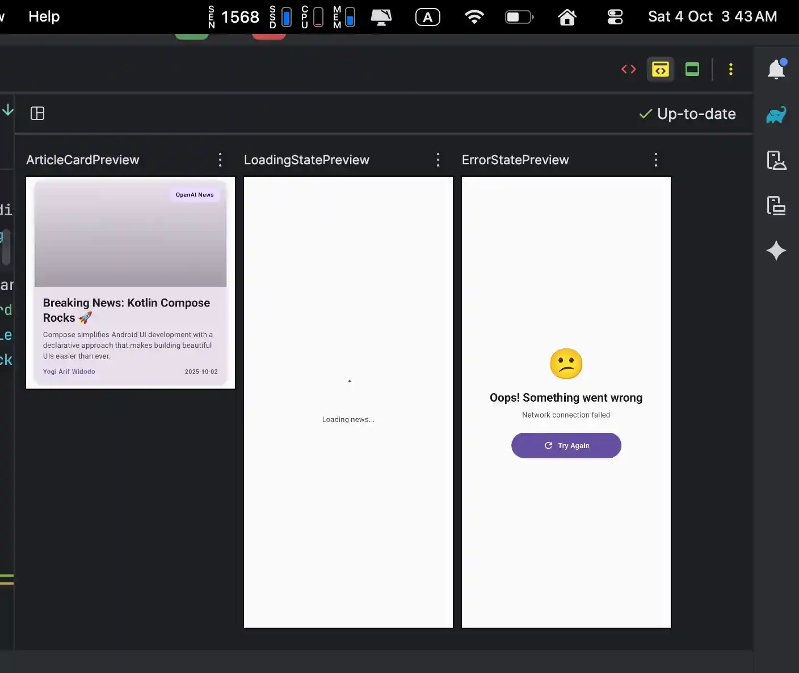

# 📰 NewsApp - YoNewsAi

A native Android application built with **Kotlin**, **Jetpack Compose**, and **Clean Architecture** using **Feature-Driven Development (FDD)**.  
The app consumes data from [NewsAPI.org](https://newsapi.org) and demonstrates modern Android development practices.

- Branch Bedah Coding : [Bedah-Code-001](https://github.com/yogithesymbian/yonewsai-fdd-jetpack-compose/tree/exploration/new-compose-pattern/bedah-code) `exploration/new-compose-pattern/bedah-code`
- Build APK (Release) Signing : [Google Drive Link : YoNewsAi.apk](https://drive.google.com/file/d/1_NTBp4BMmTcVkmqtwQNs1TL4VYa8Bdr7/view?usp=sharing)

---

## ✨ Features
- Fetch and display the latest news headlines.  
- View detailed information about each news article.  
- Built with **Jetpack Compose Material3** for modern UI/UX.  
- Navigation with **Navigation-Compose**.  
- **Hilt** for dependency injection.  
- **Coroutines + Flow** for async and reactive data handling.  
- **Retrofit + Moshi** for network calls.  
- **Coil** for image loading.  
- Error & loading state handling.
- Dark theme support.
  
NB: build gradle still not clean need to use lib.version.toml ( Lint Code Analysis )

---

## 🏛️ Architecture
This project follows **Clean Architecture** principles with **Feature-Driven Development (FDD)**.  

```
com.yogiveloper.yonewsai
├── core/           # shared utilities, common DI, Result wrapper
├── feature_news/   # main feature module # but i wrap with modules folder
│    ├── data/      # repositories, API service, DTOs
│    ├── domain/    # models, use cases, repository interfaces
│    ├── presentation/
│    │    ├── list/    # NewsListScreen + ViewModel
│    │    └── detail/  # NewsDetailScreen + ViewModel
│    └── di/        # Hilt modules for feature
└── MainActivity.kt # host navigation
````

### Flow
1. **Data Layer** → `NewsApiService` (Retrofit) → `NewsRepositoryImpl`.  
2. **Domain Layer** → `GetTopHeadlinesUseCase` (business logic).  
3. **Presentation Layer** → `NewsListViewModel` → `NewsListScreen` (Compose UI).  

---

## 📸 Screenshots
| News List | News Detail (1) | News Detail (2) |
|-----------|-------------|-------------|
|  |  |  |

### 🖼️ Jetpack Compose Preview
| News List |
|-----------|
|  | 

### 🦊 Highlight TODO


- [x] Slicing the UI from [dribble news mobile](https://dribbble.com/shots/20776712-GoRead-News-App)
- - [x] home
- - - [x] YoBreakingNews 
- - - [x] Recommendation
- - [ ] discover
- - [x] details
- [x] Shared Element Transition [guide](https://developer.android.com/develop/ui/compose/animation/shared-elements)
- - [x] with navigation compose
- [x] News API doesn't provide a `get article by id` endpoint, so a simple cache is used for intent details.

---

## 🛠️ Tech Stack
- **Kotlin 2.0.21**  
- **Jetpack Compose (Material3)**  
- **Navigation-Compose**  
- **Hilt (DI)**  
- **Retrofit + Moshi**  
- **Coil (image loading)**  
- **Coroutines + Flow**  
- **JUnit, Mockito, Compose UI Test**  

---

## ✅ Requirements
- Android Studio **Koala Feature Drop | 2025**  
- Gradle 8.5+  
- Min SDK 24  

---

## 🔧 Setup & Installation
1. Clone repository:
```bash
   git clone https://github.com/yogithesymbian/yonewsai-fdd-jetpack-compose.git
````

2. Get an API key from [NewsAPI.org](https://newsapi.org).
3. Add the key in `gradle.properties`:

   ```
   NEWS_API_KEY=your_api_key_here
   ```
4. Build & run the project:

   ```bash
   ./gradlew assembleDebug
   ```

---

## 🧪 Testing

* Unit tests:

    * `GetTopHeadlinesUseCaseTest`
* UI tests:

    * `NewsListScreenTest`

Run all tests:

```bash
./gradlew test
./gradlew connectedAndroidTest
```

---

## 📚 Learning Goals

This project demonstrates:

* Building UI with **Jetpack Compose**.
* Applying **Clean Architecture** in an Android app.
* Using **FDD (Feature-Driven Development)** for modularity.
* Writing **unit tests & UI tests** in Compose.

## 💡 Note from Developer

To be honest, I mostly use AI to help with development. I completed Java and Kotlin classes on Dicoding in 2019 and last worked with Kotlin Native in 2021. Now, thanks to AI, I can easily build native apps using FDD, including unit and UI tests. It also makes code reviews easier and helps reduce mistakes. I always ask for references from official documentation, public journals, or books to support the final answers. 

[Practical magic with animations in Jetpack Compose](https://www.youtube.com/watch?v=HNSKJIQtb4c)

---

## 📄 License

This project is licensed under the MIT License - see the [LICENSE](LICENSE) file for details.

Copyright (c) 2025 yogiveloper / yogithesymbian (Yogi Arif Widodo)
